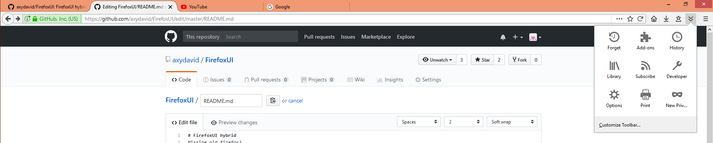
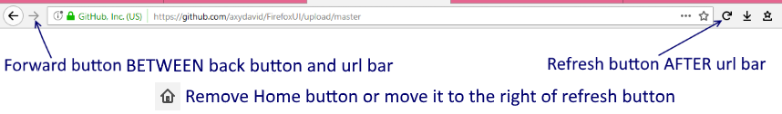

# FirefoxUI hybrid
Missing old firefox?
This theme is a combination between australis UI and photon UI, hopefully you'll like it :D

# IMPORTANT!!!
- Copy the userStyle.css file to your firefox profile chrome folder [Tutorial](http://kb.mozillazine.org/index.php?title=UserChrome.css&printable=yes)

- Please make sure to customize the order of your buttons as it shows in the image below, before you install skin:

- Due to the experimental nature of Nightly Mozilla tends to break the theme, if you use Nightly uncomment the section: 
/* NIGHTLY FIX */
Please note that this does NOT apply to Firefox Stable, Beta and Developer channels, it ONLY applies to Nightly channel.

# Screenshots

