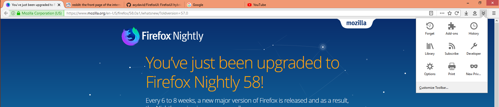
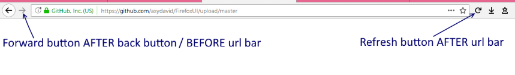
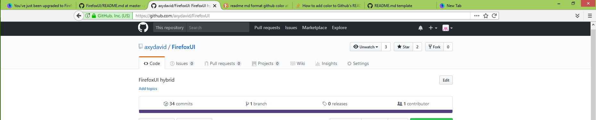
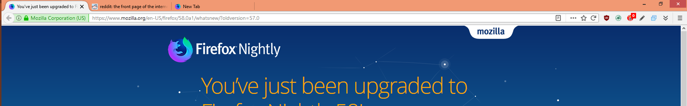
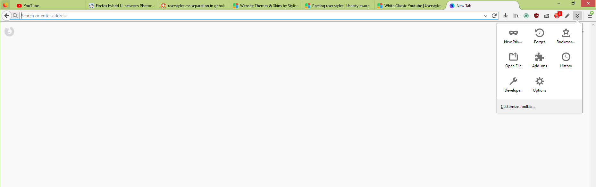

# FirefoxUI hybrid
Missing old firefox?
This theme is a combination between australis UI and photon UI, hopefully you'll like it :D

# IMPORTANT!!!
- Please make sure to customize the order of your buttons as it shows in the image below, before you install skin:

- Due to the experimental nature of Nightly Mozilla tends to break the theme, if you use Nightly just uncomment the section: 
/* NIGHTLY FIX */

# Screenshots

